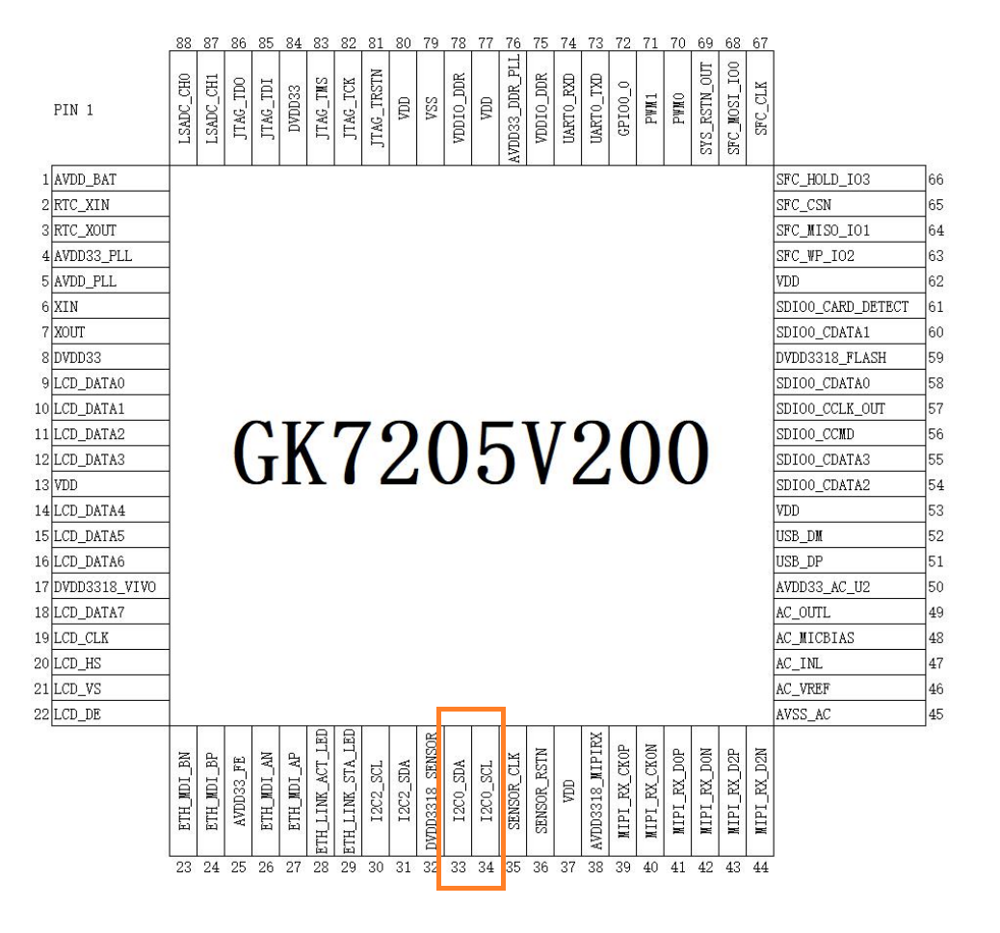
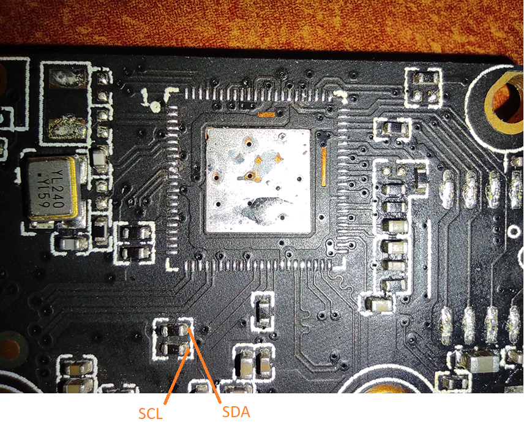
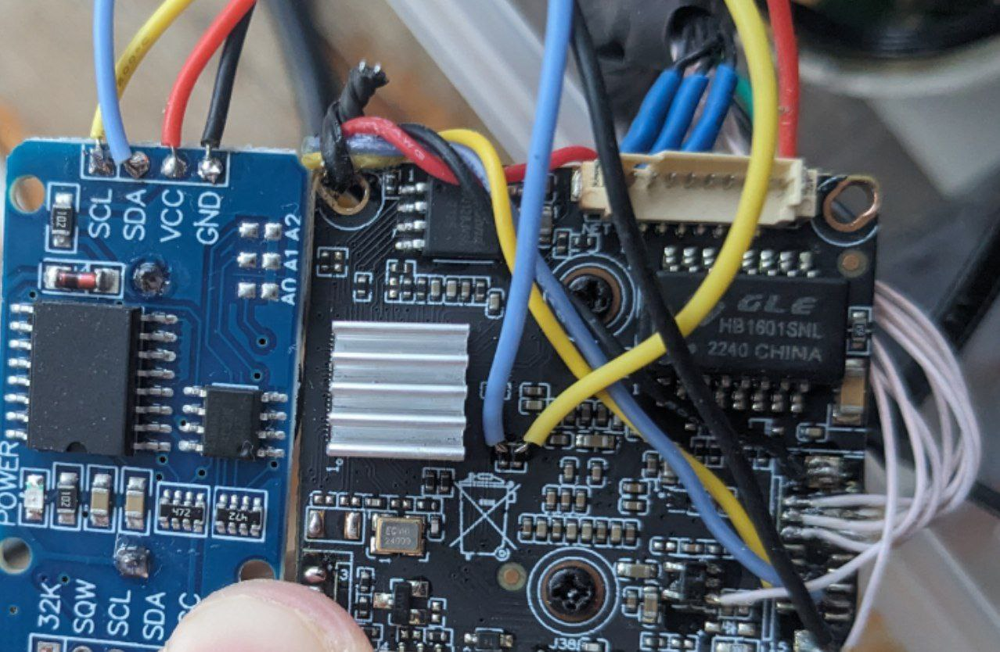

# Подключение внешнего модуля реального времени DS3231 по I2C

Для примера будет использоваться камера `IVG-G2S` с SOC `GK7205v200`.

1. Перед подключением выполните команду `i2cdetect -y -r 0`
Вывод должен быть примерно таким:
```sh
root@openipc-gk7205v200:~# i2cdetect -y -r 0
     0  1  2  3  4  5  6  7  8  9  a  b  c  d  e  f
00:          -- -- -- -- -- -- -- -- -- -- -- -- --
10: -- -- -- -- -- -- -- -- -- -- 1a -- -- -- -- --
20: -- -- -- -- -- -- -- -- -- -- -- -- -- -- -- --
30: -- -- -- -- -- -- 36 -- -- -- -- -- -- -- -- --
40: -- -- -- -- -- -- -- -- -- -- -- -- -- -- -- --
50: -- -- -- -- -- -- -- -- -- -- -- -- -- -- -- --
60: -- -- -- -- -- -- -- -- -- -- -- -- -- -- -- --
70: -- -- -- -- -- -- -- --
```
Убеждаемся что нету адресов `57` и `68`. 
`1a` и `36` в моём случае это адреса сенсора.

2. Находим шину `i2c` на вашей камере и паяемся к ней.
Я подпаялся к резисторам.



3. Найдите на плате `GND` и 5 вольт или 3.3 вольта, и подключите туда питание RTC модуля. Вставьте батарейку в RTC модуль.
У меня получилось так:


4. Снова выполните команду `i2cdetect -y -r 0`
Должен появиться адрес `68`
```sh
root@openipc-gk7205v200:~# i2cdetect -y -r 0
     0  1  2  3  4  5  6  7  8  9  a  b  c  d  e  f
00:          -- -- -- -- -- -- -- -- -- -- -- -- --
10: -- -- -- -- -- -- -- -- -- -- 1a -- -- -- -- --
20: -- -- -- -- -- -- -- -- -- -- -- -- -- -- -- --
30: -- -- -- -- -- -- 36 -- -- -- -- -- -- -- -- --
40: -- -- -- -- -- -- -- -- -- -- -- -- -- -- -- --
50: -- -- -- -- -- -- -- 57 -- -- -- -- -- -- -- --
60: -- -- -- -- -- -- -- -- 68 -- -- -- -- -- -- --
70: -- -- -- -- -- -- -- --
```

5. Установка времени. По умолчанию `DS3231` считает от `2000-01-01 00:00:00`
Модуль принимает и отдаёт десятичные цифры в шестнадатирочном формате.
```sh
i2cset -y 0 0x68 0x00 0x00 // start at 0 seconds
i2cset -y 0 0x68 0x01 0x15 // start at 15 minutes
i2cset -y 0 0x68 0x02 0x22 // start at 22 hours

i2cset -y 0 0x68 0x04 0x02 // start at 2 day of month
i2cset -y 0 0x68 0x05 0x11 // start at 11 month
i2cset -y 0 0x68 0x06 0x24 // start at 2024 year
```
Автоматическая установка времени от NTP сервера пока не реализована.

6. Установите скрипт установки времени `systemtime_from_ds3231.sh` при старте камеры. 
Для примера я добавил его содержимое в `/etc/rc.local`
