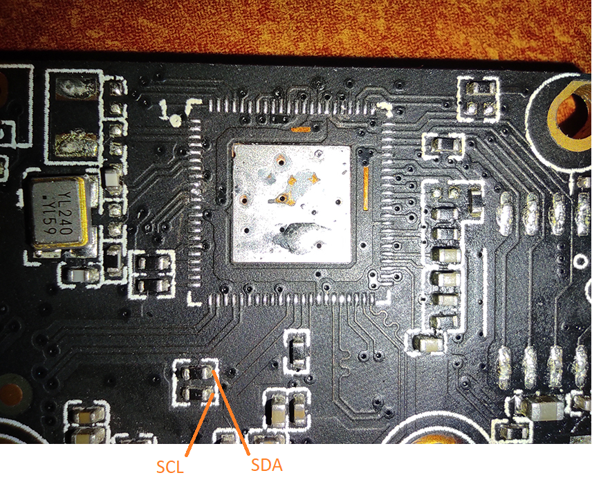

# Connecting an external RTC module DS3231 with I2C

A camera will be used as an example `IVG-G2S` witch SOC `GK7205v200`.

1. Before connecting, run the command `i2cdetect -y -r 0`
The output should be something like this:
```sh
root@openipc-gk7205v200:~# i2cdetect -y -r 0
     0  1  2  3  4  5  6  7  8  9  a  b  c  d  e  f
00:          -- -- -- -- -- -- -- -- -- -- -- -- --
10: -- -- -- -- -- -- -- -- -- -- 1a -- -- -- -- --
20: -- -- -- -- -- -- -- -- -- -- -- -- -- -- -- --
30: -- -- -- -- -- -- 36 -- -- -- -- -- -- -- -- --
40: -- -- -- -- -- -- -- -- -- -- -- -- -- -- -- --
50: -- -- -- -- -- -- -- -- -- -- -- -- -- -- -- --
60: -- -- -- -- -- -- -- -- -- -- -- -- -- -- -- --
70: -- -- -- -- -- -- -- --
```
We make sure that there are no addresses `57` and `68`. 
`1a` and `36` in my case these are sensor addresses.

2. Find the `i2c` ​​bus on your camera and solder to it.
I soldered to the resistors.



3. Find `GND` and 5 volts or 3.3 volts on the board and connect the RTC module power supply there. Insert the battery into the RTC module.
Example:


4. Run `i2cdetect -y -r 0` command again
The address should appear `68`
```sh
root@openipc-gk7205v200:~# i2cdetect -y -r 0
     0  1  2  3  4  5  6  7  8  9  a  b  c  d  e  f
00:          -- -- -- -- -- -- -- -- -- -- -- -- --
10: -- -- -- -- -- -- -- -- -- -- 1a -- -- -- -- --
20: -- -- -- -- -- -- -- -- -- -- -- -- -- -- -- --
30: -- -- -- -- -- -- 36 -- -- -- -- -- -- -- -- --
40: -- -- -- -- -- -- -- -- -- -- -- -- -- -- -- --
50: -- -- -- -- -- -- -- 57 -- -- -- -- -- -- -- --
60: -- -- -- -- -- -- -- -- 68 -- -- -- -- -- -- --
70: -- -- -- -- -- -- -- --
```

5. Setting the time. By default, `DS3231` counts from `2000-01-01 00:00:00`
The module accepts and returns decimal digits in hexadecimal format.
```sh
i2cset -y 0 0x68 0x00 0x00 // start at 0 seconds
i2cset -y 0 0x68 0x01 0x15 // start at 15 minutes
i2cset -y 0 0x68 0x02 0x22 // start at 22 hours

i2cset -y 0 0x68 0x04 0x02 // start at 2 day of month
i2cset -y 0 0x68 0x05 0x11 // start at 11 month
i2cset -y 0 0x68 0x06 0x24 // start at 2024 year
```
Automatic time setting from NTP server is not yet implemented.

6. Install the time setting script `systemtime_from_ds3231.sh` when the camera starts.
For example, I added its contents to `/etc/rc.local`
