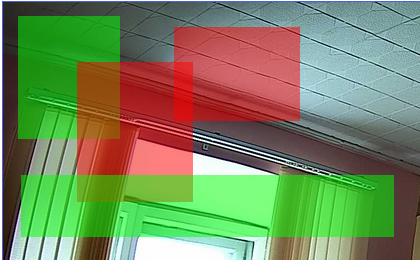

## OpenIPC VisualMotion



Adds to `majestic_webui` **visual editor** for regions of _interest_ and _exluded_ from motion detection.

Works on fresh Firefox, Chromium, Edge.

_Currently, this script doesnt save any changes to config, this is concept demo._

### How to use
- copy all files from `m` directory into `/var/www/m` directory on camera
- add line from code below in `/var/www/cgi-bin/status.cgi` after `<%in p/header.cgi %>`
```
<%in ../m/roi.html %>
```
- open in broser http://ca.me.ra.ip/

To change image size, edit `0.99` in `roi.js` at your taste, or replace whole line with `const IMG_WIDTH = 800;`.
### Known bugs

Fresh OpenIPC firmware doesnt setup parameter `.video0.size` automatically to resolution of sensor. 

**Workaround:** execute `cli -g .video0.size 2592x1520`, or change this parameter in webui.

Note: `2592x1520` - is my sensor resolution, check your hardware!

### ToDo
- save values to camera config
- read current values from `roi/roe` fields and draw rectangles
